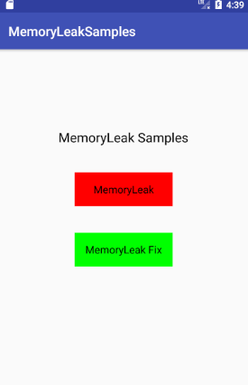
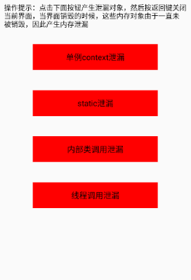
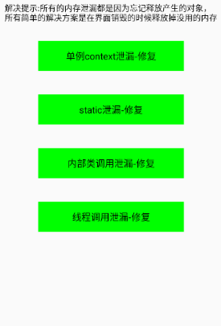

# MemoryLeakSamples
MemoryLeakSamples,contant context leak、staic leak、thread leak

# Preview

# Demo Apk

you can scan the qrcode for download demo apk

    

# Document
### [Android Studio 分析内存泄漏工具指南](http://www.jianshu.com/p/25fdc4793d33)  

# Attention Me

 
# License
 
    Copyright 2017, Rotate3D , 1179537855@qq.com
 
    Licensed under the Apache License, Version 2.0 (the "License");
    you may not use this file except in compliance with the License.
    You may obtain a copy of the License at
 
        http://www.apache.org/licenses/LICENSE-2.0
 
    Unless required by applicable law or agreed to in writing, software
    distributed under the License is distributed on an "AS IS" BASIS,
    WITHOUT WARRANTIES OR CONDITIONS OF ANY KIND, either express or implied.
    See the License for the specific language governing permissions and
    limitations under the License.
